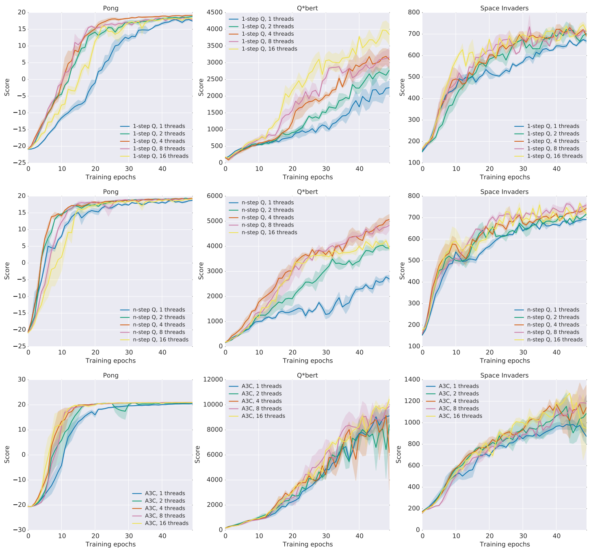
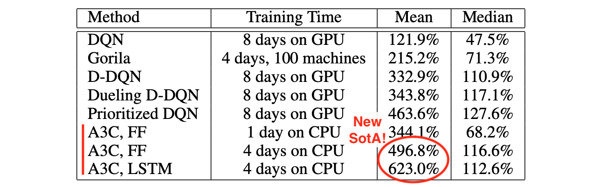

# Asynchronous Methods for Deep Reinforcement Learning

!!! tldr
    - Introduces an RL framework that uses multiple CPU cores to speed up training on a single machine.
    - The main result is A3C, a parallel actor-critic method that uses shared layers between actor and critic, n-step returns and entropy regularization.
    - Parallel training for value-based methods is also investigated, but results are less convincing.
    - A synchronous version called A2C, geared towards GPUs, is generally preferred nowadays.[^a2c]
     
    **February 2016 - [arXiv](https://arxiv.org/abs/1602.01783)**

Scaling up RL
---

This paper introduces a multi-threaded RL training framework. Its main result is the **A3C algorithm**, which at the time of publication beat the state of the art on the Atari domain while training for only half the time. The core idea is to scale up training by using the multiple CPU cores available on modern workstations.  

Scaling up the training process brings two advantages:

- It enables shorter training times, as it allows us to throw more compute at the problem
- It helps stabilize training, by decorrelating the experiences observed by the agent

Decorreleting updates
---

A common problem in reinforcement learning is the correlation and non-stationarity of successive experiences. When using off-policy methods such as [DQN](dqn.md), it is possible to use a [replay buffer](experience-replay.md) to store experiences then sample them randomly. This is more complicated when using on-policy algorithms such as [policy gradient methods](policy-gradient-methods.md), as they can't reuse past experiences.

The proposed framework addresses this problem by executing multiple agents in parallel:

> Instead of experience replay, we asynchronously execute multiple agents in parallel, on multiple instances of the environment. This parallelism decorrelates the agents’ data into a more stationary process, since at any given timestep the parallel agents will be experiencing a variety of different states.

For off-policy methods, this is a memory vs compute trade-off:

- Replay buffers are memory-intensive, but use little computing power
- Parallel agents are CPU-intensive, but are not as memory-hungry as replay buffers

Note that it would be possible to combine a replay buffer - either central or separate per worker - with parallel agents. 
Going in this direction leads us to architectures such as Gorila or Ape-X.

For on-policy methods, there is no downside to using parallel agents, as they can't learn from previous experiences! (Following this publication other methods came up to address this limitation such as [ACER](acer.md), [IMPALA](impala.md) and others.)

Implementation details
---

A stated goal of this framework is to leverage multi-cores CPUs without relying on GPUs:

> Our parallel reinforcement learning paradigm also offers practical benefits. Whereas previous approaches to deep reinforcement learning rely heavily on specialized hardware such as GPUs or massively distributed architectures, our experiments run on a single machine with a standard multi-core CPU.

Since the gradients are calculated on a CPU, there's no need to batch large amount of data to optimize performance. As a result, the updates are performed asynchronously: each agent performs a number of training steps then performs an asynchronous updates with the global parameters.

Here's the algorithm as pseudocode: [^original]

Performing all the computation on the CPU of a single machine means that there is no communication overhead, and that updates can be done Hogwild-style without any locking.  

Evaluation
---

The paper first provides a comparison of multiple RL methods used within this framework: SARSA, deep Q-learning, n-step deep Q-learning, and advantage actor-critic.

The evaluation is performed on four different platforms:

- The traditional [Atari](atari.md) learning environment, using 5 games
- The [Torcs](http://torcs.sourceforge.net/) driving simulator, using 4 game modes
- The [Mujoco](mujoco.md) domain, using 14 tasks
- A custom "labyrinth" environment (subsequently released as [DeepMind Lab](dm-lab.md))
 
Parallel methods learn faster in almost all cases. The results are most impressive when combining the parallel framework with advantage actor-critic. See for example the last line of these benchmarks on 3 Atari games: [^original]

The resulting method is **A3C**, the "Asynchronous Advantage Actor Critic" - this paper's claim to fame!

The paper then provide in-depth evaluation of A3C on the Atari domain, using the complete test suite of 57 games. 
Looking at mean performances, A3C reaches state of the art status, training twice faster than its competition: [^original]

It should be noted that the question of [evaluation of RL agents](how-to-benchmark.md), and more specifically evaluation when using Atari games, has been hotly debated since this paper came out. The use of the mean performance is no longer regarded as reliable as some games can easily skew the final ranking.

Extra improvements
---

Beyond its parallel nature, A3C includes a number of improvements compared to vanilla [advantage actor critic](actor-critic.md):

- The layers are shared between the actor and the critic
- Both actor and critic use n-step learning
- The policy uses entropy regularization
- Adding an LSTM layer helps in some environments
- The RMSProp optimizer uses shared statistics between agents 

From A3C to A2C
---

Since this method is designed to train networks using a CPU, asynchronous updates made a lot of sense as it enabled [Hogwild syle](hogwild.md) updates. However, it appeared later on that this was not optimal when using a GPU. For this reason, this method is commonly used today in a synchronous way in which the updates from all the actor-learners are batched to make better use of the GPU. This non-asynchronous version is simply called **A2C** (Advantage Actor Critic) [^a2c].

However, a different method called A2C, which does leverage GPUs, is preferred today.

In hindsight
---

- ✅ Executing multiple agents in parallel is a good way to decorrelate observations
- ❌ Asynchronous updates are not a good match for GPU training: see [A2C](#from-a3c-to-a2c)
- ❌ Using exclusively on-policy data is bad for sample efficiency: see [ACER](acer.md), [IMPALA](impala.md)

Key concepts
---

"Building blocks" involved in this work:

- Builds on [Actor-Critic](actor-critic.md) methods
- Introduces a multi-threaded [parallel training](parallel-training.md) method
- Uses [entropy regularization](entropy-regularization.md)
- Uses an LSTM [Recurrent Neural Network](rnn.md) layer
- Uses [multi-step return](n-step-return.md)
- Uses [shared layers](shared-layers.md) between policy and value functions
- Benchmarked on [Atari games](atari.md)

Links
---

- [Actor-Critic Methods: A3C and A2C](https://danieltakeshi.github.io/2018/06/28/a2c-a3c/) from Daniel Seita, a detailed walkthrough

Authors
---

- Volodymyr Mnih [Twitter](https://twitter.com/vladmnih)/[Scholar](https://scholar.google.com/citations?user=rLdfJ1gAAAAJ)/[Academic](https://www.cs.toronto.edu/~vmnih/)
- Adrià Puigdomènech Badia [Scholar](https://scholar.google.com/citations?user=DcWRJW4AAAAJ)
- Mehdi Mirza [Twitter](https://twitter.com/memimo)/[Scholar](https://scholar.google.com/citations?user=c646VbAAAAAJ)/[Personal](https://memimo.net/)
- Alex Graves [Scholar](https://scholar.google.com/citations?user=DaFHynwAAAAJ)/[Academic](https://www.cs.toronto.edu/~graves/)
- Tim Harley [Twitter](https://twitter.com/_timharley)/[Scholar](https://scholar.google.com/citations?user=yxwU5CMAAAAJ)
- Timothy P. Lillicrap [Twitter](https://twitter.com/countzerozzz)/[Scholar](https://scholar.google.com/citations?user=htPVdRMAAAAJ)/[Personal](http://contrastiveconvergence.net/~timothylillicrap)
- David Silver [Scholar](https://scholar.google.com/citations?user=-8DNE4UAAAAJ)/[Personal](https://www.davidsilver.uk/)
- Koray Kavukcuoglu [Twitter](https://twitter.com/koraykv)/[Scholar](https://scholar.google.com/citations?user=sGFyDIUAAAAJ)/[Personal](https://koray.kavukcuoglu.org/)

[^a2c]: [OpenAI Baselines: ACKTR & A2C](https://openai.com/blog/baselines-acktr-a2c/)
[^original]: excerpts from original paper