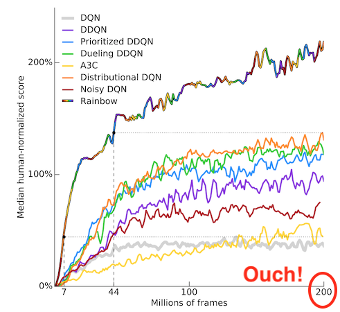
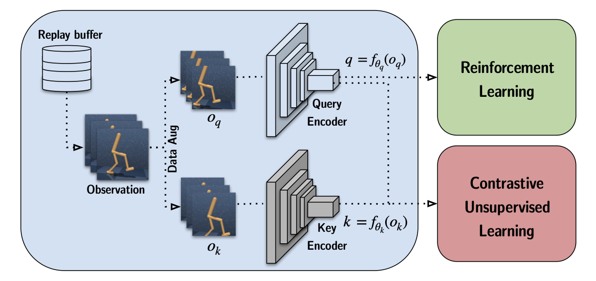
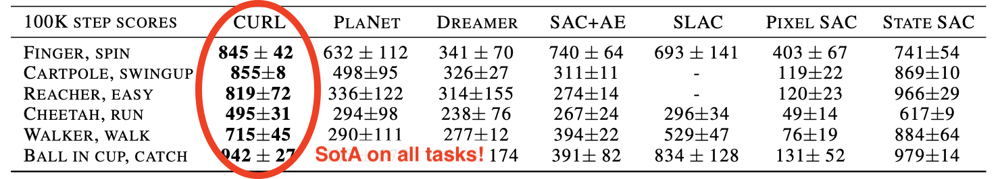
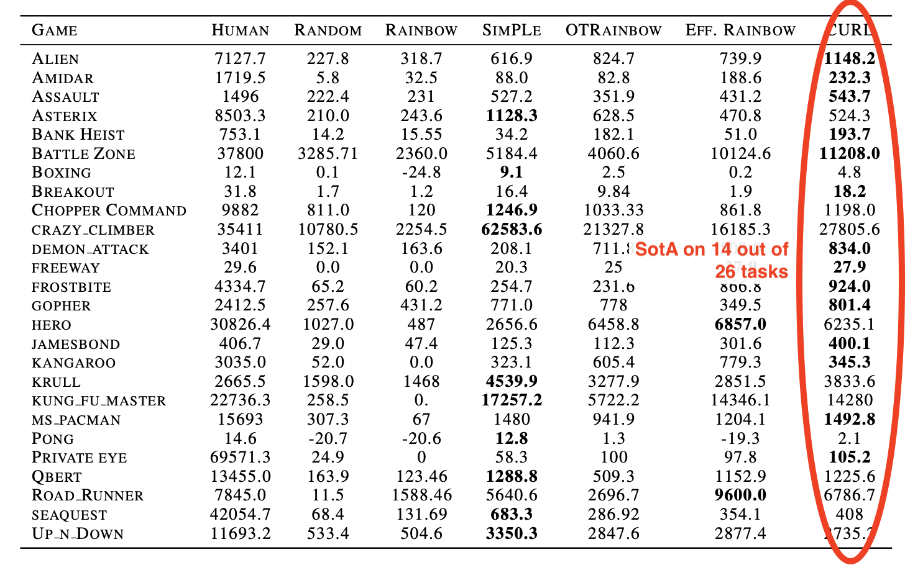

# CURL: Contrastive Unsupervised Representations for Reinforcement Learning

!!! tldr
    - CURL improves the sample efficiency when learning from pixels by using contrastive learning, a self-supervised method, as an auxiliary task. 
    - The contrastive objective works similarly to the SimCLR framework, using random cropping as an augmentation method.
    - After 100k interactions, CURL outperforms all other methods on DM Control Suite, and shows strong results on Atari games.  

    **April 2020 - [arXiv](https://arxiv.org/abs/2004.04136) - [Code](https://github.com/MishaLaskin/curl)**
    
    
### What is this about?
In reinforcement learning, solving a task *from pixels* is generally much harder than solving an equivalent task using physical features such as coordinates and angles. This makes a lot of sense: you can consider an image as a high-dimensional vector containing hundreds of features, which don't have any clear connection with the goal of the environment!

As a result, you generally need a lot more interactions between an agent and its environment in order to learn a good policy. For example, the figure below shows the results of multiple recent RL methods on the DeepMind Control Suite, learning from physical features. Take a look the X axis: depending on the complexity of the task, the agents are trained from 1 to 10 million interactions: [^sac] 

On the other, let's have a look at results using Atari games as a benchmark. There is no notion of "physical" features with the Atari emulator: the only observations the agent can work with are RGB images. The agents now have to be trained for a staggering 200 million frames![^rainbow] Some distributed approaches even consider numbers up to a billion. 

This low sample-efficiency is clearly a problem. Not only does it mean the experiment turn-around time is excessive, it also means that there can be little hope of bringing such methods to real-world problems. Can you imagine having to collect billions of real-world interactions?

The paper we are considering takes a stab at this problem by bringing recent advances from vision and NLP to reinforcement learning. Contrastive learning takes advantage of data augmentation to learn more efficiently. CURL shows that it can be very useful in the context of RL to learn a good latent representation faster.

### What is contrastive learning?
The core idea is to compare (contrast!) pairs of augmented samples. We consider two kinds of such pairs:

- **Positive pairs** consist of two different augmentations of the *same sample* 
- **Negative pairs** contain augmentations of two *different samples*

For each sample, we create a set of positive and negative pairs. The contrastive representation is then learned by maximizing the agreement between positive pairs, and minimizing the agreement between negative pairs

Contrastive learning has seen dramatic progress in recent years for language and vision. See for example BERT, an application to masked language modeling[^bert], or the SimCLR framework, used to learn visual representations[^simclr]. 

The way contrastive learning is implemented in CURL is mostly influenced by the SimCLR framework[^simclr], Momentum Contrast (MoCo)[^moco] and Contrastive Predictive Coding (CPC)[^cpc].

### How CURL works
With CURL, the same latent representation is used for both the RL algorithm and the contrastive learning, as illustrated below: [^paper-screenshot]

CURL uses random crops to augment the observations. 
Since most RL methods use frame-stacking, each observation is effectively a "stack" of sequential images. CURL preserves their temporal structure by applying the same augmentation to each frame in the stack. 

The illustration below gives an example of a positive pair: the same observation is augmented in two different ways. The representation will be changed in a way that maximizes their agreement. [^paper-screenshot]

### Evaluation
Using a contrastive objective as an auxiliary task significantly improves the performance of the underlying RL algorithm. 
The performance is evaluated in two settings:

- with [SAC](sac.md) on DeepMind Control Suite (continuous control)
- with data-efficient [Rainbow DQN](rainbow.md) on Atari games (discrete control). 

In both cases, the performance is evaluated after 100k interactions, as the goal is to evaluate sample efficiency rather than asymptotic performance. 

Results are remarkable on DeepMind Control Suite : [^paper-screenshot]

(The last column, *State SAC*, uses physical states and is used as an "oracle" upper-bound.)

Results are very good on Atari games. This is again after 100k interactions: [^paper-screenshot]

How can this difference in performance be explained? One idea explored in the appendix is that in some environments, there is simply not enough information to fully recover the state when looking only at the pixel data: the problem becomes **partially observable**.  

### Key concepts
"Building blocks" involved in this work:

- Focuses on [sample efficiency](sample-efficiency.md)
- Uses [contrastive learning](contrastive-learning.md)
- Uses [auxiliary tasks](auxiliary-tasks.md)
- Benchmarked on [DeepMind Control Suite](dm-control-suite.md)
- Benchmarked on [Atari games](atari.md)

### Limitations
- ❌ No comparison with [MuZero](muzero.md), which is SotA on multiple Atari games[^muzero-tweet]

### Authors
- Aravind Srinivas [Twitter](https://twitter.com/Aravind7694)/[Scholar](https://scholar.google.com/citations?user=GhrKC1gAAAAJ)/[Academic](https://people.eecs.berkeley.edu/~aravind/)
- Michael Laskin [Twitter](https://twitter.com/MishaLaskin)/[Scholar](https://scholar.google.com/citations?user=DOGDnwsAAAAJ)/[Academic](https://mishalaskin.github.io/)
- Pieter Abbeel  [Twitter](https://twitter.com/pabbeel)/[Scholar](https://scholar.google.com/citations?user=vtwH6GkAAAAJ)/[Academic](https://people.eecs.berkeley.edu/~pabbeel/)

### Links

- [Official code repository](https://github.com/MishaLaskin/curl), a PyTorch implementation for SAC
- [Official project page](https://mishalaskin.github.io/curl/), a good short summary of the paper
- [Twitter summary](https://twitter.com/Aravind7694/status/1248049713149906945) from first author

[^sac]: [Soft Actor-Critic: Off-Policy Maximum Entropy Deep Reinforcement Learning with a Stochastic Actor](https://arxiv.org/abs/1801.01290)
[^rainbow]: [Rainbow: Combining Improvements in Deep Reinforcement Learning](https://arxiv.org/abs/1710.02298)
[^bert]: [BERT: Pre-training of Deep Bidirectional Transformers for Language Understanding](https://arxiv.org/abs/1810.04805)
[^simclr]: [A Simple Framework for Contrastive Learning of Visual Representations](https://arxiv.org/abs/2002.05709) (SimCLR)
[^moco]: [Momentum Contrast for Unsupervised Visual Representation Learning](https://arxiv.org/abs/1911.05722) (MoCo)
[^cpc]: [Data-Efficient Image Recognition with Contrastive Predictive Coding](https://arxiv.org/abs/1905.09272) (CPC)
[^paper-screenshot]: excerpts from original paper
[^muzero-tweet]: [https://twitter.com/gwern/status/1248087160391163906](https://twitter.com/gwern/status/1248087160391163906)
