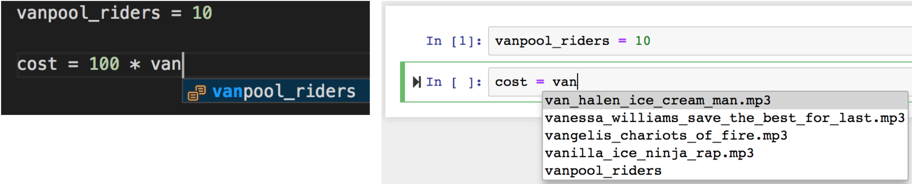
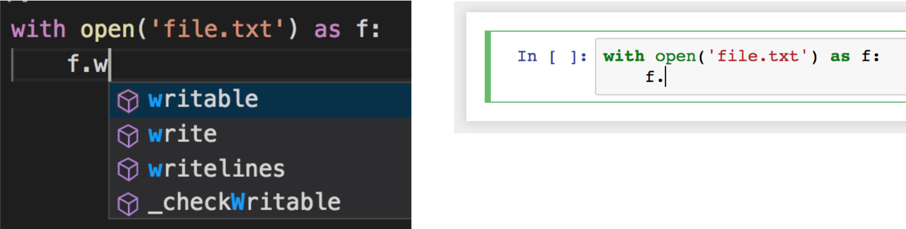

# Notebook Pitfalls

!!! hint
    This concept is not directly related to reinforcement learning, however, it is still relevant to RL researchers! 

Notebooks are a great way to run quick experiments and exploratory data analysis. They're also perfect to show off your work. Services such as [Google Colab](https://colab.research.google.com/) and [MyBinder](https://mybinder.org/) even provide free compute in the form of notebooks. What's not to love?

As we will see, notebooks do come with a number of **pretty bad pitfalls**.

They are still an amazing tool, but they require some careful considerations before you integrate them into your workflow.

Error-prone execution flow
---

The first pitfall is the way code gets executed in notebooks: the execution of each cell alters the global state. 
There is no warranty that cells are ran in order, which can result in confusing situations if you don't keep track of cell history.

In the example above[^grus], the final results seems surprising. 
What happened is that a change was done to the global state between the first and second cell, in a cell that has since been deleted. 
This problem often happens with module imports or function definitions: it is easy to accidentally delete a cell that doesn't look useful anymore, only to realize later that its content was indeed needed. 
Since the side effect of that cell kept effect until the runtime was restarted, the problem can be overlooked for some time.

A solution is to **run "Restart Runtime and Run All" aggressively**.
This is your best weapon against hidden states.

The example above[^grus] appears even nastier at first look, but is less common in practice.
Here, what happened is that the content of some cells was modified after being executed, which surprisingly is not visible from the notebook UI.

One use case where this can happen is if you start a long running task, then start editing other parts of the code.
It can quickly become confusing to remember which parts of your code where changed before and after the start of that task, which can make debugging difficult if said task doesn't complete as expected.

A solution is to **commit your notebook often**, ideally every time before you start a long-running task. This ensures that you have a snapshot of the state of your notebook when the task started. The page [Running Long Tasks in Notebooks](notebooks-long-tasks.md) describes such workflows in more details.

Poor code assist
---

Modern IDEs, such as IntelliJ, have amazing auto-complete capabilities. They will not only suggest completions as you type, but will also perform type checking and other form of sanity checks that can save you precious time.

In contrast, autocomplete in notebooks is still terribly lackluster: [^grus]

Notebooks don't take advantage of type information: [^grus]

At this point, IDEs and notebooks provide two different approaches to improve iteration time:

- IDEs: top-notch autocomplete helps writing code faster and more confidently
- Notebooks: instant execution of each piece of code helps you check that it work as expected  

Could they be combined? I think so. Modern Javascript engines are good enough to run the advanced heuristics Eclipse or IntelliJ uses under the hood. 
It's hopefully only a matter of time before such approaches are implemented.

Beyond autocompletion and type checking, IDEs offer two other invaluable tools:

- Linting: IDEs will clean up entire files to conform to PEP8 at the push of a button
- Refactoring: IDEs can perform advanced refactors, looking through multiple files

Both of these make it easier to keep your code clean and readable.

"I don't like notebooks"
---

These two points are inspired by a 2018 talk by [Joel Grus](https://joelgrus.com/), a veteran Python developer and author. I recommend you watch the full video:

The slide deck is also available [on Google Doc](https://docs.google.com/presentation/d/1n2RlMdmv1p25Xy5thJUhkKGvjtV-dkAIsUXP-AL4ffI/preview?slide=id.g362da58057_0_1).

Joel raises many other points, such as how notebooks hinder modularity and testability, and other usability problems.

[^grus]: [I don't like notebooks.- Joel Grus (Allen Institute for Artificial Intelligence)](https://www.youtube.com/watch?v=7jiPeIFXb6U)